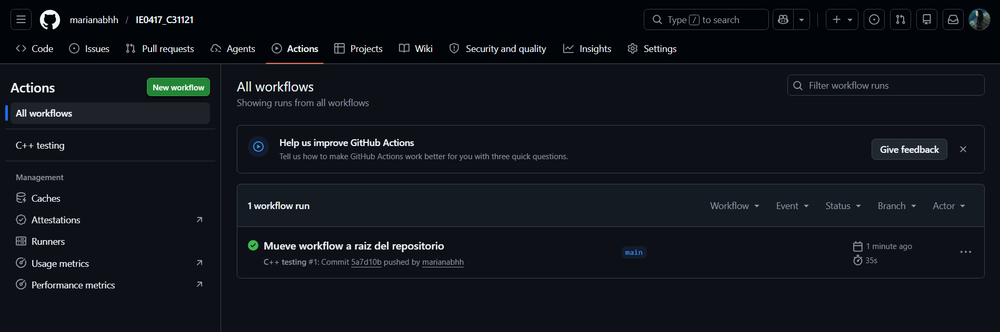

# Parte 6: GitHub Actions

## Qué es integración continua

La integración continua (CI) es una práctica de desarrollo donde los cambios de código se verifican automáticamente cada vez que se suben al repositorio. Permite detectar errores rápidamente antes de que afecten a otros.

## Qué hace el archivo testing.yml

Configura un workflow que se ejecuta automáticamente en GitHub cada vez que se hace push o pull request a la rama main. Instala dependencias, compila el proyecto y ejecuta las pruebas.

## En qué eventos se ejecuta

- `push` a la rama `main`
- `pull_request` hacia la rama `main`

## Pasos del workflow

1. Checkout del repositorio
2. Instalación de dependencias (`build-essential`, `cmake`, `lcov`)
3. Configuración con CMake
4. Compilación con make
5. Ejecución de pruebas con `./run_tests`

## Resultado del workflow

El workflow ejecutó exitosamente los 47 tests en GitHub Actions.

## Qué pasaría si una prueba falla

GitHub Actions marcaría el workflow con ❌ y notificaría al desarrollador. El commit quedaría marcado como fallido y sería visible en la pestaña Actions.

## Fallo intencional en CI

Se cambió `EXPECT_EQ(add(2, 3), 5)` por `EXPECT_EQ(add(2, 3), 999)` para provocar un fallo.

Localmente el test falló mostrando:
```
Expected: add(2, 3) = 5
To be equal to: 999
[  FAILED  ] CalculatorTest.AddPositiveNumbers
```

En GitHub Actions el workflow apareció con ❌ y el paso "Run tests" mostró el mismo error.

Se corrigió restaurando el valor esperado a `5` y el workflow volvió a pasar con ✅.

## Preguntas de reflexión

1. Ejecutar pruebas automáticamente en GitHub asegura que el código siempre funcione antes de integrarse.
2. CI resuelve el problema de integrar código que funciona localmente pero rompe el proyecto de otros.
3. Ejecutar pruebas antes de integrar evita introducir errores en la rama principal.
4. GitHub Actions muestra el log completo del error, el paso que falló y el mensaje de la prueba.
5. CI mejora la colaboración porque todos confían en que el código en main siempre compila y pasa las pruebas.


